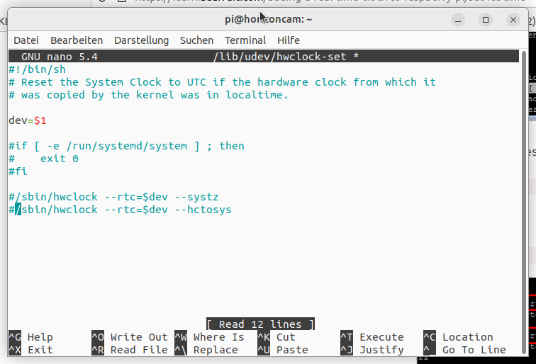

# How to set up

1. put [Raspberry Pi OS Lite image](https://www.raspberrypi.com/software/) on SD-Card
2. create a empty ssh file in /boot/
3. create wpa_supplicant.conf and put
```
country=de
update_config=1
ctrl_interface=/var/run/wpa_supplicant

network={
 scan_ssid=1
 ssid="MyNetworkSSID"
 psk="Pa55w0rd1234"
}
```
(replace SSID and password with your own)

4. connect PiCamera to cable and Pi
5. connect RTC-module to GPIO-pins

| DS1307 |	Pi GPIO |
|---|---|
| GND |	P1-06 |
| Vcc	| P1-01 (3.3V) |
| SDA	| P1-03 (I2C SDA) |
| SCL	| P1-05 (I2C SCL) |


7. execute the [setup script](/shared/setup.sh)

## Manual installation

# history der horizoncam

install necessary software
~~~
    0 sudo apt update
    1 sudo apt install git python3-picamera
~~~

aktvivate camera-interface and i2c for RTC

~~~
    2  sudo raspi-config
~~~

test camera, install upgrades

~~~
    3  git clone https://github.com/gruener-campus-malchow/strato4.git
    4  python3 ./strato4/dumbcam/takephotos.py 
    5  sudo apt upgrade
    6  reboot
~~~

enable hardware-clock



~~~
   12  sudo nano /boot/config.txt
   13  sudo reboot
   14  sudo i2cdetect -y 1
   15  sudo apt install i2cdetect
   16  sudo apt install i2c-tools
   17  sudo i2cdetect -y 1
   18  sudo raspi-config
   19  sudo i2cdetect -y 1
   20  sudo apt-get -y remove fake-hwclock
   21  sudo update-rc.d -f fake-hwclock remove
   22  sudo systemctl disable fake-hwclock
   23  sudo nano /lib/udev/hwclock-set
   24  sudo hwclock -r
   25  history
~~~
